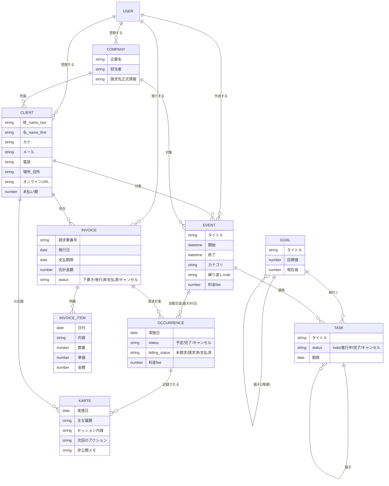

# Cautas（かうたす）ヘルプセンター執筆用 仕様情報

> **この文書について**
> カウンセラー向け業務管理アプリ「Cautas（かうたす）」のヘルプセンター（説明書）を別サイトで執筆するための、**コードで確認した正確な仕様情報**です。執筆担当AI/ライター向けの元ネタであり、これ自体は完成した説明書ではありません。
>
> - **情報取得日**: 2026-07-09
> - **対象バージョン**: 最終コミット `52cd03f`（2026-07-09）「Remove pet-raising partner feature and refine UI to a professional look」
> - **確認方法**: 実際のソースコード（`src/index.tsx`、`public/static/*.js`、`migrations/*.sql`）を精査
> - **凡例**: `⚠未確認` = コードで確定できなかった / `🚧未実装` = 機能が存在しない・準備中 / 画面文言は実際の表示を「」で引用
> - **重要な注意**: アプリ名は正式には**「かうたす」**（ひらがな）。全ページ`<title>`が「〜 - かうたす」。
>
> **⚠ 2026-07-10 追記（本スナップショット以降のアプリ側変更・LP作成者メモ）**
> 以下は本資料（07-09）取得後にアプリ側で実施された変更。Guide執筆時はこちらを優先すること。
> - **繰り返し予定の90日制限は撤廃**（§3-2・§8-5・§10の「最大90日」記述は無効。終了日までまとめて生成される）
> - UIをブルー基調に統一・緑を一掃（意味色は保持）／モーダル刷新 → 実UIスクショ撮影時は新デザインで
> - 名鑑（カウンセラー/講師）を外部公開サイト化（写真×モーション・ストーリー欄・悩みから探す・AIマッチング）
> - Google Calendar連携ボタン修復＋OAuth設定
> - 全テーブルRLS有効化・請求書APIのトークン転送（セキュリティ強化）
>
> **⚠ 2026-07-12 追記（さらに以降の変更）**
> - 料金プラン確定・実装（フリー¥0／ライト¥3,300／ソロ¥6,600／プロ¥9,800／チーム¥19,800〜準備中）。詳細は `docs/pricing.md`・`docs/app-update-2026-07-12.md`・アプリ内 `/pricing`。課金強制は未発動（現状全ユーザー無制限）
> - **§5-2の「報告書の一覧・再表示は未実装」は解消**：一覧・再表示・プレビュー・印刷が実装済み（Guide ai-report/faq を更新済み）
> - **§4-4の「カルテテンプレートは端末内(localStorage)のみ」は解消**：クラウド保存で端末間同期に（Guide karte/faq を更新済み）
> - 予定に「資料・リンク」欄を追加（当日ワンタップで資料/Zoomを開ける）＋クライアントの予定からそのクライアントページへ直接遷移
> - 請求書番号を連番方式（全体連番／取引先ごと連番／ランダム）から選択可
> - 思考整理AIは「カウンセラー自身の働き方整理」用（クライアントの目標設計ではない）。誇大表現は禁止
> ※上記はチャットでの口頭共有ベース。細部は次回のコード再スナップショットで確認推奨。

---

## 0. 執筆時に特に注意すべき「用語のゆれ・古い記述」

コード確認の結果、社内ドキュメント（CLAUDE.md等）と実UIで食い違う点が見つかりました。**説明書では実UI側（下記「正」）を採用してください。**

| 論点 | 実UI（正・これを使う） | 古い/誤った記述（使わない） |
|------|----------------------|--------------------------|
| 実績ページのタブ | 「ダッシュボード」「実績入力」の2ページタブ＋入力内に4カテゴリタブ | 「5タブ構成（売上/…）」は誤り。「売上」はタブでなくサマリー表示 |
| 請求書作成ボタン | 「選択から請求書作成」 | 「この内容で請求書を作成」「選択から作成」は現存しない |
| キャンセルの綴り | 予定は`canceled`（Lひとつ）、請求書は`cancelled`（Lふたつ） | 内部的にゆれあり（表示ラベルは日本語なので利用者影響は小） |
| 「予定」と「セッション」 | **同じもの**を指す。作成/編集画面では「予定」、集計/記録では「セッション」と呼ぶ | — |
| PDF出力 | 実PDF生成ではなく**ブラウザ印刷でPDF保存**する方式 | 「PDFを生成」と書くと誤解を招く |

---

## 1. 全体像

### 1-1. 画面（ページ）一覧

| 画面名（サイドバー表示） | URLパス | できること（1行） |
|------------------------|---------|------------------|
| ロビー | `/` | 今日の予定・タスク・週次サマリー・未請求アラートを見るホーム画面 |
| カレンダー | `/calendar` | 予定（セッション）を月/週で表示・作成・編集する |
| タスク | `/tasks` | やることリストの管理（繰り返し・目標連携対応） |
| クライアント | `/clients` | 相談者の情報を登録・管理、1人の全履歴を集約表示 |
| 企業 | `/companies` | 法人契約先（企業）の管理、名刺AI読み取り |
| カルテ | `/kartes` | セッション記録の作成・一覧・AI要約・報告書作成 |
| 目標 | `/goals` | 目標設定（3階層）とAIアシスタント対話 |
| 実績 | `/performance` | 売上・セッション数の自動集計と過去実績入力 |
| 請求書 | `/invoices` | 未請求セッションから請求書を作成・発行・入金管理 |
| カウンセラー名鑑 | `/counselors` | 公開プロフィールを持つカウンセラーを探す |
| 講師名鑑 | `/trainers` | 公開プロフィールを持つ研修講師を探す |
| 設定 | `/profile` | アカウント設定・請求書の発行者情報・公開プロフィール編集 |
| （プロフィールプレビュー） | `/profile/preview` | 自分の公開プロフィールの見え方を確認 |
| （ログイン） | `/auth` | ログイン・新規登録・パスワードリセット |

補足:
- `/lobby` は `/` へ、`/dashboard` は `/performance` へ自動リダイレクト。
- モバイルではロビーのヘッダー表記が「ダッシュボード」になる（同じ画面）。

### 1-2. サイドバーメニュー（実際の表示順・文言）

上から: 「ロビー」「カレンダー」「タスク」「クライアント」「企業」「カルテ」「目標」「実績」「請求書」「カウンセラー名鑑」「講師名鑑」「設定」。最下部にユーザー名と「ログアウト」。

### 1-3. 用語集（アプリが使う正式な呼び名）

| 用語 | 意味 | 補足 |
|------|------|------|
| **予定** | カレンダーに登録する1件の面談・研修等の枠。作成/編集画面での呼び名 | 内部テーブル: `events`（繰り返しの親）＋`occurrences`（個別の発生日） |
| **セッション** | 「予定」と同じ実体を、件数集計・記録の文脈で呼ぶ名 | 「今日のセッション」「総セッション数」等 |
| **クライアント** | 相談者・受講者（個人） | 姓・名で管理 |
| **企業** | 法人契約先（B2B） | 企業配下に複数クライアントを紐付け可能 |
| **カルテ** | 1回のセッションの記録（議題・内容・様子・次回アクション等） | 予定（occurrence）と紐付け可能 |
| **実績** | 完了したセッションの件数・売上の集計 | 「完了」ステータスのみカウント |
| **請求書** | クライアント/企業への請求文書 | 未請求セッションから作成 |
| **目標** | 大/中/小の3階層で管理する達成目標 | AIアシスタントで設計可能 |
| **タスク** | やること（To-Do） | 目標・予定・クライアントと紐付け可能 |
| **カテゴリ** | 予定の種類（カウンセリング/コーチング/研修等11種） | 集計・売上判定に影響 |

---

## 2. はじめ方

### 2-1. アカウント作成〜ログイン

**認証方法は2つ**: ①メールアドレス＋パスワード、②Google アカウント（「Googleでログイン」/「Googleで登録」）。

**新規登録の手順**（`/auth` の「新規登録」タブ）:
1. 「新規登録」タブを選ぶ
2. 「お名前」「メールアドレス」「パスワード」（「8文字以上」）「パスワード（確認）」を入力
3. 「利用規約」「プライバシーポリシー」への同意にチェック
4. 「アカウントを作成」を押す
5. **確認メールが届く** → 「確認メールを送信しました。メールに記載されたリンクをクリックして、登録を完了してください。」と表示 → メール内リンクをクリックして登録完了
   - （※管理側でメール確認が無効化されている場合は、そのままログイン状態になる）

**ログインの手順**（「ログイン」タブ）:
1. 「メールアドレス」「パスワード」を入力（「ログイン状態を保持」チェックあり）
2. 「ログイン」を押す（またはGoogleボタン）
3. ログイン後、ロビー（`/`）へ移動

**パスワードを忘れた場合**: ログイン画面の「パスワードをお忘れですか？」→ メールアドレス入力 →「リセットメールを送信」。

**よく出るエラー文言**:
- 「メールアドレスまたはパスワードが正しくありません。」
- 「メールアドレスが確認されていません。メールをご確認ください。」（＝確認メールのリンク未クリック）
- 「このメールアドレスは既に登録されています。」（新規登録時）

### 2-2. 初回ログイン後の画面と最初にやるべき設定

- **最初に見える画面**: ロビー（`/`）。上部に「こんにちは！」の挨拶。
- **最初に設定すべきもの**（説明書での推奨順・機能有無はコード確認済み）:
  1. **設定（`/profile`）で発行者情報を登録** — 請求書に印刷される「正式屋号/事業所名・氏名・郵便番号・住所・振込先」。これを入れないと請求書の請求元が空欄になる。
  2. **クライアントを登録**（`/clients`「新規登録」）— 予定やカルテに紐付けるため。
  3. （任意）企業契約があれば**企業を登録**（`/companies`）。

---

## 3. 予約（予定）管理

### 3-1. 予定を作成する

**開き方（どちらでもよい）**:
- カレンダー画面右上の「予定を追加」ボタンを押す
- 週ビューで時間帯をクリック（その時刻で開く）／月ビューで日付をクリック（その日9:00〜10:00で開く）

**入力項目**（モーダル見出し「予定を追加」）:

*必須項目*
| 項目 | ラベル | 種類 |
|------|--------|------|
| タイトル | 「タイトル」＊ | テキスト |
| 開始日時 | 「開始」＊ | 日時 |
| 終了日時 | 「終了」＊ | 日時 |

*任意項目（基本）*
- 「終日」チェック（オンで日付のみの「開始日」「終了日」に切替）
- **カテゴリ**（初期「カテゴリを選択」）: 「💬 カウンセリング」「🎯 コーチング」「📚 研修（講師）」「📖 受講」「💼 コンサルティング」「👨‍🏫 スーパービジョン」「🛠️ ワークショップ」「👥 グループセッション」「📊 アセスメント」「🤝 打ち合わせ」「📌 その他」
- **「繰り返し」**（後述）
- クライアント/企業（タブ「個人(B2C)」「企業(B2B)」で切替）
  - 個人: 「クライアントを選択」
  - 企業: 「企業を選択」→ 担当者が表示され、「対応クライアント」で複数選択可

*任意項目（詳細設定 — 折りたたみ「詳細設定」を開く）*
| 項目 | ラベル | 選択肢・備考 |
|------|--------|------------|
| 実施形式 | 「形式」 | 「オンライン」「対面」「電話」 |
| 場所 | 「場所」 | 「Zoom URL、住所など」 |
| 電話番号 | 「電話番号」 | 「090-1234-5678」 |
| 対象タイプ | 「対象タイプ」 | 「個人」「企業」「両方」 |
| 参加人数 | 「参加人数」 | 研修系カテゴリのとき表示、単位「名」 |
| 料金 | 「料金」 | ¥（1000円刻み） |
| ステータス | 「ステータス」 | 「予定」「完了」「キャンセル」 |
| 請求状況 | 「請求状況」 | 「未請求」「請求済」「支払済」 |
| 請求対象 | 「請求対象」 | チェック。オンで「単価」欄が出る |
| メモ | 「メモ」 | 「メモや備考」 |
- 色: 8色から選択可
- 保存は「保存」ボタン

**自動補完**（ユーザーが意識せず起きること）:
- クライアント/企業を選ぶと、タイトルに「【企業名】」「【クライアント名】」が自動追記される（既に含まれる場合は追記しない）
- 「形式」を切り替えると「場所」欄が自動入力される: 対面→住所 / オンライン→オンラインURL / 電話→電話番号（登録済みの値がある場合のみ）

### 3-2. 繰り返し設定（あり）

「繰り返し」ドロップダウンの選択肢: 「繰り返さない」「毎日」「毎週」「平日のみ（月〜金）」「毎月」「毎年」。
繰り返しを選ぶと「終了日」欄が現れる（「繰り返さない」に戻すと消える）。
- ⚠**制限**: 繰り返し予定は内部的に**最大90日分**しか個別日程（occurrence）が生成されない。終了日を90日より先にしても、90日以降の日程は自動生成されない。

### 3-3. 予定の編集・削除・複製（あり）

カレンダー上の既存予定をクリック → 詳細モーダルのヘッダー右上に3つのアイコンボタン:
- 「複製」（コピーアイコン）: 同じ内容で新規予定として複製
- 「編集」（ペンアイコン）: 編集モーダルを開く
- 「削除」（ゴミ箱アイコン）: 削除
※ボタンはアイコン表示（マウスを乗せると名称が出る）。

### 3-4. クライアント情報の登録・紐付け

**登録**: クライアント画面（`/clients`）の「新規登録」ボタン → モーダル「新規クライアント登録」。
主な入力欄: 「姓」＊／「名」／「姓（カナ）」「名（カナ）」（ひらがな入力で自動カタカナ変換・編集可）／「メールアドレス」／「電話番号」／「所属企業」／「部署」「役職」／「場所（カレンダー用）」（カレンダーの場所欄に自動入力される名称）／「正式住所（請求書用）」／「オンラインURL（Zoom等）」／「生年月日」／「性別」／「タグ」（カンマ区切り）／「メモ」。

**予定への紐付け**: 予定作成フォームの「個人(B2C)」タブでクライアントを選ぶ、または「企業(B2B)」タブで企業＋「対応クライアント」を選ぶ。
- 🚧 予定作成フォーム内から新規クライアントをその場で登録する導線は無い（先にクライアント画面で登録が必要）。

---

## 4. カルテ・記録

### 4-1. カルテの作成（手入力・音声どちらも可）

カルテはすべて通常の入力欄なので、**キーボードで直接入力できる**（音声は補助）。

**入力欄**（モーダル「カルテを作成」）:
| 欄 | ラベル | 必須 |
|----|--------|------|
| 関連セッション | 「関連セッション（任意）」 | 任意（完了済み予定から選択） |
| 実施日 | 「セッション実施日」＊ | 必須 |
| クライアント | 「クライアント」＊ | 必須 |
| 所属企業 | 「所属企業」 | クライアント選択で自動表示 |
| 種別 | 「セッション種別」 | 「初回カウンセリング」「フォローアップ」「緊急対応」「グループセッション」「完了」「その他」 |
| 所要時間 | 「所要時間（分）」 | 初期値60 |
| 主な議題 | 「主な議題」＊ | 必須 |
| タグ | 「タグ（カンマ区切り）」 | 任意 |
| セッション内容 | 「セッション内容」 | 任意 |
| クライアントの様子 | 「クライアントの様子」 | 任意 |
| 目標への進捗 | 「目標への進捗」 | 任意 |
| 次回のアクション | 「次回のアクション」 | 任意 |
| 非公開メモ | 「非公開メモ（カウンセラーのみ閲覧可）」 | 任意 |
| 報告書に含めない内容 | 「報告書に含めない内容」 | 任意 |
| 報告書用メモ | 「報告書用メモ」 | 任意 |

保存は「保存」ボタン。

### 4-2. 音声記録（音声入力）の手順

**対応欄（6つ）**: 「主な議題」「セッション内容」「クライアントの様子」「目標への進捗」「次回のアクション」「非公開メモ」。各欄の横にマイクアイコンのボタン（「音声入力」）がある。

**手順**:
1. 記録したい欄の横の🎤（マイク）ボタンを押す
2. ブラウザが**マイクの使用許可**を求める → 許可する
3. 録音が始まり、ボタンが停止アイコン＋経過時間（分:秒）表示に変わる。「🎤 録音を開始しました（タップで停止）」と表示
4. 話し終えたら**同じボタンをもう一度押す** → 「処理中」表示（スピナー）
5. 文字起こし結果がその欄に追記される（既に文字があれば改行して追加）。「✅ 文字起こし完了（N文字）」と表示

**前提条件**:
- **マイクの許可が必須**（拒否すると「マイクへのアクセスが許可されていません」）
- 対応ブラウザ: マイク録音（`getUserMedia`/`MediaRecorder`）に対応したブラウザ。録音形式はブラウザに応じてWebM/MP4を自動選択
- 録音が短すぎ（約1秒未満）→「録音時間が短すぎます。もう少し長く話してください。」／長すぎ（25MB超）→「録音が長すぎます（最大25MB）」
- 文字起こしエンジン: **OpenAI Whisper**（日本語）

### 4-3. AI要約

- **ボタン**: 「セッション内容」欄の下の「✨ AI要約を生成」
- **前提**: 「セッション内容」に**50文字以上**入力されていること
- **入力**: セッション内容・クライアント名・実施日
- **出力**: 「クライアントの様子」「目標への進捗」「次回のアクション」「非公開メモ」を自動生成し、各欄に反映。タグも3〜5個提案（既存タグと重複しないものを追加）
- **タイミング**: ボタンを押したとき（自動ではない）。生成中は「AI生成中...」表示
- **エンジン**: Claude Haiku 4.5

**出力イメージ**（例）:
> クライアントの様子: 前回より表情が明るく、仕事の話を自発的にされた。睡眠状況の改善も報告あり。
> 次回のアクション: 職場でのストレス対処法を一緒に整理する。睡眠記録の継続を依頼。
> タグ: 睡眠, 職場, 前向き

### 4-4. カルテテンプレート

カルテ入力画面上部のテンプレートバー:
- 「テンプレートを選択…」（選ぶと内容が各欄に反映）
- 「保存」（現在の入力内容をテンプレートとして保存。名前を尋ねられる：例「初回面談」「継続セッション」）
- ゴミ箱アイコン（選択中のテンプレートを削除）
- ⚠**注意**: テンプレートは**その端末のブラウザ内にのみ保存**（`localStorage`）。別のPC/スマホには引き継がれない。

---

## 5. AI分析・報告書

### 5-1. AI機能の一覧（入力→出力）

| 機能 | 実行方法 | 入力 | 出力 | エンジン |
|------|---------|------|------|---------|
| カルテAI要約 | 「✨ AI要約を生成」ボタン | セッション内容 | 様子/進捗/次回/メモ/タグ | Claude Haiku 4.5 |
| 音声文字起こし | 🎤ボタン | 録音音声 | テキスト | OpenAI Whisper |
| 離脱リスク分析 | クライアント詳細の「リスク分析を実行」ボタン | セッション履歴・頻度 | リスクスコア/レベル/推奨アクション | Claude Haiku 4.5 |
| 目標設計アシスタント | 目標画面のAIボタン（対話） | ユーザーとの対話 | 目標・タスクの提案と保存 | Claude Sonnet 5 |
| 名刺読み取り | 企業画面で名刺画像アップロード | 名刺画像 | 企業名・担当者・連絡先等をフォームに自動入力 | Claude（Vision） |
| 報告書生成 | 「報告書作成」ボタン（後述） | カルテ内容 | 報告書ドラフト | Claude Sonnet 5 |
| セッション連動タスク提案 | 24時間以内にセッションがあると自動表示 | 直近セッション | 準備タスクの提案 | Claude Haiku 4.5 |

**離脱リスク分析の出力例**（クライアント詳細画面）:
> リスクスコア: 72/100（高）
> 推奨アクション: 今週中に連絡を取り近況を確認する／セッション頻度低下の理由をヒアリングする

- **所要時間の目安**: ⚠コードに明示なし（通常は数秒〜十数秒程度。過負荷時は最大3回自動リトライ）。

### 5-2. 報告書機能（現状 = 一部🚧未実装）

**報告書を作る場所と種類**:
- カルテ詳細画面の「報告書作成」ボタン（オレンジ）→「セッション報告書」（本人向け）/「経過報告書」（企業人事向け）の2種
- カルテ一覧画面の「月次報告書」ボタン → 期間を指定して月次報告書
- 実績（講師業タブ）の「研修報告書作成」→ 選択した研修から研修報告書

**作成の流れ**（4ステップ）: ①タイプ選択 → ②報告先（「本人（クライアント）」「企業人事部」「上司・管理職」「その他」）・期間・含める項目を選ぶ → ③「AIで生成」or「手動で作成」 → ④プレビュー＆編集 → 「保存」。

**⚠重要な制限（説明書で必ず触れる）**:
- 🚧 **保存した報告書を後から一覧・再表示する画面が無い**（`/api/reports/list`・一覧ビューが未実装）。生成→編集→保存はできるが、保存後にアプリ内で開き直す導線が現状ない。
- 🚧 プレビュー機能の一部は「プレビュー機能は準備中です」表示。
- 出力はアプリ内テキスト。PDF化する専用機能はこの報告書側には無い（請求書とは別）。

---

## 6. 実績管理

### 6-1. 何が・いつ・どう自動カウントされるか

- **カウント条件**: 予定（occurrence）の**ステータスが「完了（completed）」のものだけ**が集計される。「予定」「キャンセル」はカウントしない。
- **タイミング**: 予定を「完了」にした時点で自動的に実績へ反映（手動操作不要）。
- **売上への計上**: 収入カテゴリ（カウンセリング/コーチング/研修/コンサル/スーパービジョン/ワークショップ/グループセッション/アセスメント）の完了セッションの「料金（fee）」を合計。料金未設定の場合のみ目安単価を使用。
  - ⚠「受講」「打ち合わせ」「その他」は**売上に含めない**（自分が受講した費用等のため）。
- **合計 = 過去実績（手入力）＋ カレンダー実績（完了分）**。

### 6-2. 画面の見方・期間切替

- 上部に「ダッシュボード」「実績入力」の2つのタブ。
- **ダッシュボード**: 「売上」「セッション数」等のサマリーカード。期間ボタン「今月」「四半期」「年」。
- **実績入力**: カテゴリタブ「💬 カウンセリング」「🎯 コーチング」「📚 講師業」「📖 受講」。期間「総数」「月別」「年度」「期間指定」（年度開始月は設定可・初期4月）。
- **過去実績の手入力**: 「過去実績数（数値入力）」欄で、カレンダー登録前の実績を数値で加算できる（講師業は「受講者数」も）。

---

## 7. 請求

### 7-1. 請求書の作成手順

1. 請求書画面（`/invoices`）の「未請求セッション」タブを開く（初期表示）
2. 請求したいセッションのチェックボックスを選ぶ（複数可）
3. 「選択から請求書作成」ボタンを押す
4. 「請求書を作成」モーダルで内容を確認・調整して保存 → 「請求書を作成しました」
5. 作成すると、そのセッションは自動的に「請求済（billed）」になり、未請求一覧から外れる

### 7-2. 未請求・請求済みの見分け方

- **未請求セッション**: 請求状況が「未請求（unbilled）」または未設定のもの。「未請求セッション」タブに表示される。
- **請求書一覧**: 作成済みの請求書は「請求書一覧」タブに表示。
- 請求書のステータス（ラベル）: 「下書き（draft）」「発行済み（issued）」「支払済み（paid）」「キャンセル（cancelled）」。
  - ⚠表示箇所により「発行済」「入金済」「支払済」と短縮/表記ゆれあり（同じ意味）。

### 7-3. 発行・入金の操作

請求書を選ぶと右パネルにボタンが出る:
- 下書き状態: 「発行」ボタン（確認「この請求書を発行しますか？発行後は編集できません。」）→ 発行済みに
- 発行済み状態: 「支払済」ボタン（確認「この請求書を支払済みにしますか？」）→ 支払済みに
- どの状態でも「PDF」ボタンあり

### 7-4. 請求書の出力形式と記載項目

- **出力形式**: 「PDF」ボタン → **ブラウザの印刷画面が開く印刷用ページ**が表示される。ページ内の「印刷 / PDF保存」ボタン（またはブラウザの印刷→PDF保存）でPDF化する。※アプリが直接PDFファイルを生成するのではない。
- **記載項目**: 見出し「請 求 書」／請求書番号・発行日・お支払期限／「請求先」（会社名・「◯◯ 様」・住所）／「請求元」（屋号・氏名・登録番号※インボイス・Email・Tel・住所）／「ご請求金額（税込）」／明細（日付・内容・数量・単価・金額）／小計・消費税（10%）・合計／「お振込先」（銀行・支店・口座種別・番号・名義）／備考。
- **請求書番号**: `INV-YYYY-MM-XXX`（末尾はランダム3桁、連番ではない）。
- **消費税**: 10%固定（端数切り捨て）。

### 7-5. 宛名・発行者の設定

- **宛名（請求先）**: 作成モーダルで「個人」「企業」を切り替え、「請求先」ドロップダウンで選択。その場で「新規登録」も可。
- **発行者（請求元）**: 設定（`/profile`）の請求書設定タブに入力した「正式屋号/事業所名・氏名・郵便番号・住所・振込先・登録番号」が使われる。**未入力だと請求元が空欄になる**ので、初回に登録が必要。

---

## 8. FAQ・トラブルの種

### 8-1. データの保管と安全性
- **保管先**: クラウド（Supabase / PostgreSQL）。**利用者ごとにデータは厳密に分離**（Row Level Security有効。他人の記録は見えない）。
- **記録データの扱い**: カルテの「非公開メモ（カウンセラーのみ閲覧可）」や「報告書に含めない内容」は、報告書生成時に配慮される設計。

### 8-2. 複数端末での利用
- 基本データ（クライアント・予定・カルテ・請求書等）はクラウド保存なので、別端末でも同じアカウントでログインすれば見られる。
- ⚠**ただし次の設定は端末ごと（ブラウザ内保存）で共有されない**: カルテテンプレート、カレンダー各種表示設定、ロビーのウィジェット表示/並び順、Google連携設定、AIパネルの見た目設定など。

### 8-3. オフライン時
- 🚧 オフライン専用の仕組みは無く、**基本オンライン前提**。ネット接続が無いと保存・読み込みができない。

### 8-4. データの削除・復元
- クライアント・カルテ・請求書には削除ボタンがあり、**確認ダイアログの後、完全に削除される（ハード削除／復元機能は無い）**。
- 予定を削除すると、その繰り返し発生分もまとめて削除される。
- クライアント/企業を削除しても、紐付いていたカルテや予定のレコード自体は残る（紐付けだけが外れる）。

### 8-5. 既知の不具合・制限事項
- 繰り返し予定は**最大90日分**しか自動生成されない（長期の繰り返しは90日以降が出ない）。
- 🚧 保存した**報告書の一覧・再表示画面が未実装**（第5章参照）。
- 🚧 目標のタイムラインでLark風の時間選択UIは未実装。
- キャンセル状態の内部表記に綴りゆれ（利用者の見た目は日本語なので影響小）。
- （運用面）Supabase無料プランは長期間アクセスが無いと一時停止することがある。

### 8-6. ログインできない時（過去実例）
- 「500 unexpected_failure」などでログインできない場合、サーバー側の設定（認証URL）やSupabase側の状態が原因のことがある。利用者側の操作では直せないケースがあるため、運営に問い合わせる。

---

## 9. スクリーンショット推奨リスト（ダミーデータで撮影）

| # | 画面名 | そこまでの行き方 | 撮る意図 |
|---|--------|----------------|---------|
| 1 | ログイン画面 | `/auth` を開く | 認証方法（メール/Google）の説明 |
| 2 | ロビー（ホーム） | ログイン直後 | 全体の入り口・今日の予定 |
| 3 | カレンダー（月ビュー） | サイドバー「カレンダー」 | 予定の見え方 |
| 4 | 予定作成モーダル | カレンダーで「予定を追加」 | 入力項目の説明（詳細設定を開いた状態） |
| 5 | 繰り返し設定 | 予定モーダルで「繰り返し」を選択 | 終了日欄が出た状態 |
| 6 | 予定詳細（複製/編集/削除ボタン） | 既存予定をクリック | 編集・削除・複製の場所 |
| 7 | クライアント登録モーダル | 「クライアント」→「新規登録」 | 入力項目 |
| 8 | クライアント詳細（360°ビュー） | クライアント一覧で名前をクリック | 次回予定・未請求・履歴の集約 |
| 9 | カルテ作成モーダル | 「カルテ」→「カルテを作成」 | 全体像＋🎤ボタンの位置 |
| 10 | 音声入力・録音中 | カルテの🎤を押す | 録音中の表示（経過時間） |
| 11 | AI要約後 | 「✨ AI要約を生成」実行後 | 各欄が自動生成された状態 |
| 12 | カルテテンプレートバー | カルテ画面上部 | 保存/選択/削除 |
| 13 | 実績ダッシュボード | 「実績」 | 売上・件数の見方＋期間ボタン |
| 14 | 未請求セッション＋選択 | 「請求書」→「未請求セッション」 | チェック→「選択から請求書作成」 |
| 15 | 請求書作成モーダル | 上記から作成 | 宛名（個人/企業）切替 |
| 16 | 請求書PDF（印刷ページ） | 請求書の「PDF」ボタン | 記載項目・印刷方法 |
| 17 | 設定・発行者情報 | 「設定」→請求書設定タブ | 初期設定の重要ポイント |
| 18 | 報告書作成モーダル | カルテ詳細「報告書作成」 | タイプ選択〜生成 |

---

## 10. データ構造（ER図）

> ユーザーが画面で目にする主要エンティティのみ。網羅ではなく理解用。



### 10-1. 状態（ステータス）の遷移

**予定（occurrence.status）** — 実際のコード値:
```
scheduled（予定）  →  completed（完了）
        \
         →  canceled（キャンセル）  ※Lひとつ
```
- 「完了」にした時点で実績にカウントされ、未請求セッションとして請求対象になる。

**請求（2つの状態を持つ）**:

セッション側の請求状態 `occurrence.billing_status`:
```
unbilled（未請求）  →  billed（請求済）  →  paid（支払済）
```
- 請求書を作成すると、対象セッションが自動で `billed（請求済）` になる。

請求書自体の状態 `invoice.status`:
```
draft（下書き）  →  issued（発行済み）  →  paid（支払済み）
                                    \
                                     →  cancelled（キャンセル）  ※Lふたつ
```

**タスク（task.status）**: `todo（未着手）` → `in_progress（進行中）` → `completed（完了）`／`cancelled（キャンセル）`。

---

## 11. 自動連携マップ（ユーザー操作 → Cautasの自動処理）

> すべてコードで確認済みの自動処理のみ記載。

| ユーザーがする操作 | Cautasが自動でやること | 確認箇所 |
|------------------|----------------------|---------|
| 新規登録（サインアップ） | プロフィール（発行者情報の器）を自動作成 | DBトリガー `on_auth_user_created` |
| 予定を作成/保存 | 個別の発生日程（occurrence）を自動生成（繰り返しは最大90日分） | DBトリガー `trigger_generate_occurrences` |
| 予定でクライアント/企業を選ぶ | タイトルに【企業名】【クライアント名】を自動追記 | `app.js` タイトル補完 |
| 予定の「形式」を切替 | 「場所」欄に住所/URL/電話を自動入力 | `app.js` autoFillLocation |
| 予定を「完了」にする | ①実績に自動カウント ②未請求セッションとして計上 ③セッション系なら「カルテ作成」を提案（クライアント・日付をプリフィル） | `lobby.js` markAsCompleted＋実績集計 |
| セッションを完了/請求状況を変更 | 該当クライアント/企業の「未払い額」「最終セッション日」「セッション数」を自動再計算 | DBトリガー `trigger_update_client_unpaid` |
| 請求書を作成 | 対象セッションを「請求済（billed）」にし、請求書と紐付け／消費税10%を自動計算／請求書番号を自動採番 | `index.tsx` 請求作成処理 |
| カルテで「✨ AI要約を生成」 | 様子・進捗・次回・メモ・タグを自動生成し各欄へ反映 | `/api/ai/summarize-karte` |
| 音声の🎤ボタン | 録音→文字起こし→対象欄に自動追記 | `/api/ai/transcribe-audio`（Whisper） |
| 目標AIアシスタントで対話 | 会話から目標・タスクを抽出して保存（タスクはstatus=todoで作成） | `goals.js` |
| 名刺画像をアップロード | 企業名・担当者・連絡先をフォームに自動入力 | `/api/ai/read-business-card` |

---

*（本仕様は 2026-07-09 時点のコードに基づく。UI文言・仕様は今後のアップデートで変わる可能性があるため、大きな変更後は再確認を推奨）*
